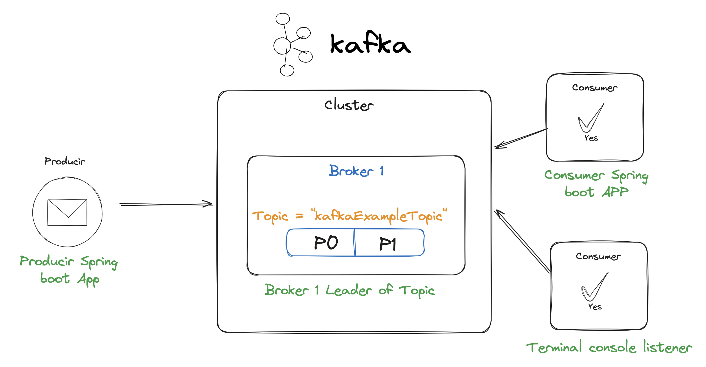

# kafka-Spring-boot

This is a spring boot application consisting of two microservices, producer and consumer.

In the Producer microservice, we create a topic called "kafkaExampleTopic" just a series of configurations that help us to quickly and efficiently process the messages that arrive to our cluster.

In the Consumer, it is in charge of listening and receiving the messages emitted by the producer and displaying them through the logger.



As we can see in the figure, we have two consumers that listen to and read the producer's messages.


# Execute Kafka
```bash
docker-compose up -d
```
## Get kafka container id
```
docker ps | grep kafka-container | awk '{print $1}'
```
We ejecute this command to run kafka and zookeeper servers as docker containers using Docker-compose file.


# Useful Commands

## Create topic into Kafka container
```bash
docker exec -it 4f763689a6fe kafka-topics --bootstrap-server localhost:9092 --create --topic example-topic --partitions 1 --replication-factor 1

docker exec -it 4f763689a6fe kafka-topics --bootstrap-server localhost:9092 --create --topic example-topic2 --partitions 1 --replication-factor 1
```

## List all topics
```bash
docker exec -it <id-container-kafka> kafka-topics --list --bootstrap-server localhost:9092
```

## Get specific data of topic
```bash
docker exec -it <id-container-kafka> kafka-topics --describe --topic example-topic --bootstrap-server localhost:9092
```